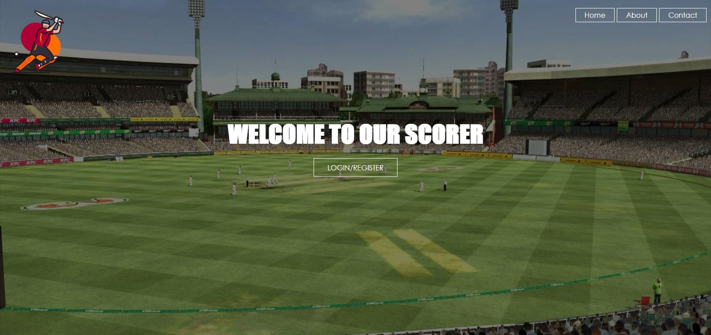

# CricketScorer
 An app to keep score of cricket matches. This Web Application was made in HTML, CSS, JavaScript and MySql and it was my first Web Development Project. The basic idea of the app was to provide cricket teams to keep track of their scores in an easier way and the abilty to challenge other teams registered on the website.
 
 This is the homepage.
 
 
