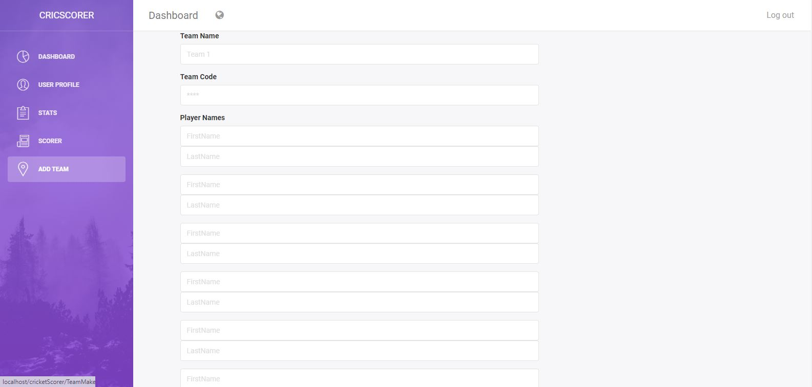

# CricketScorer
 An app to keep score of cricket matches. This Web Application was made in HTML, CSS, JavaScript and MySql and it was my first Web Development Project. The basic idea of the app was to provide cricket teams to keep track of their scores in an easier way and the abilty to challenge other teams registered on the website.
 
 This is the homepage.
 
 

Clicking on the Login Page Redirects you to the login or register page.

After you register and login, you will be redirected to your homepage. Where pie charts and bar charts will show the data of your team in a pleasing manner.

Clicking on the add team, you will be redirected to the page where you will have a form to fill in your team players' names. Also add the team code which is important. Since if someone challenges you in this game, they have to add your teeamcode also so that it can be verified that the match really took place.

After adding the team, you can click on scorer where you will get to choose the opposing teams registered on the website, select your openers and their bowlers which will take you to the main scoreboard in the game.

